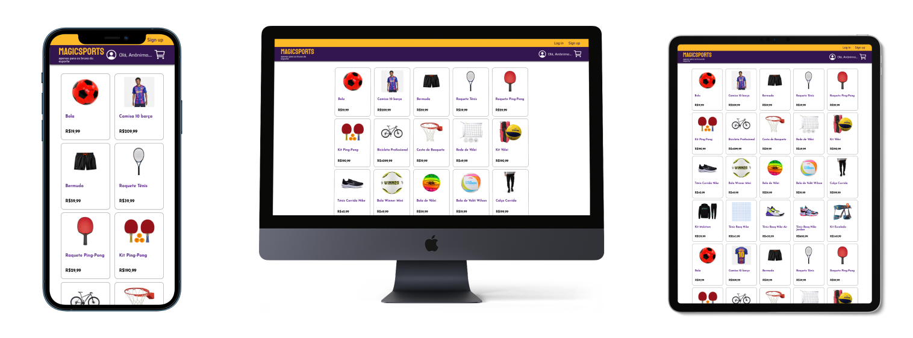
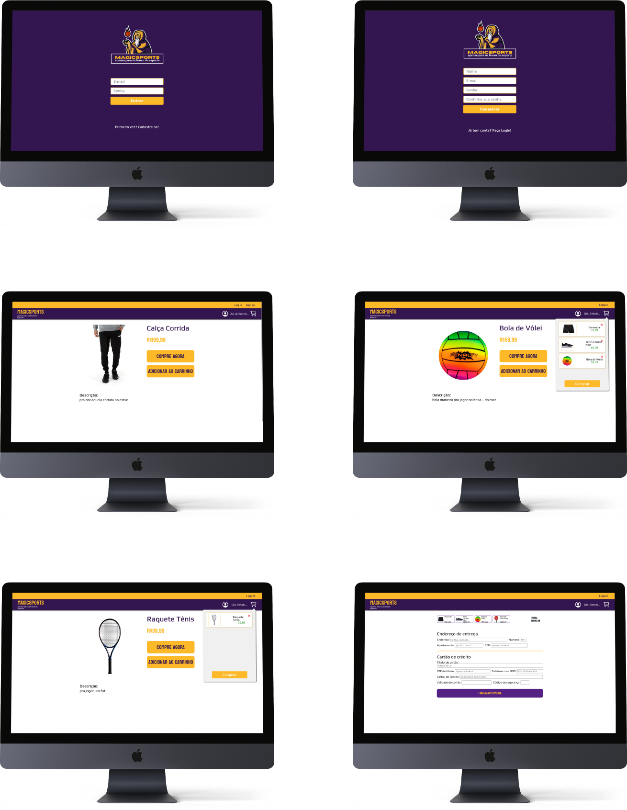
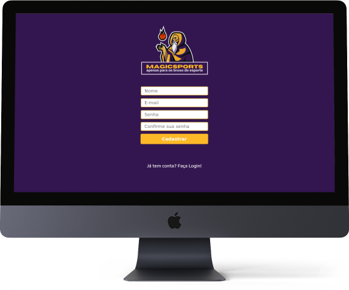
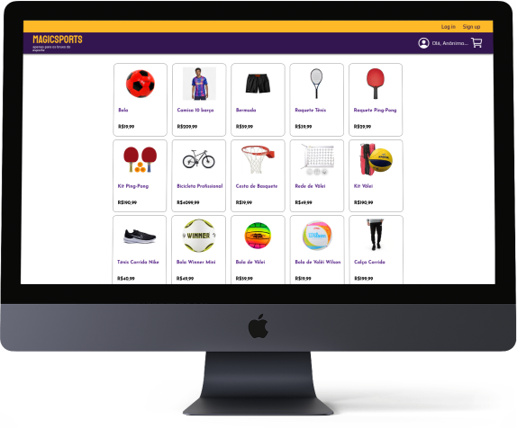
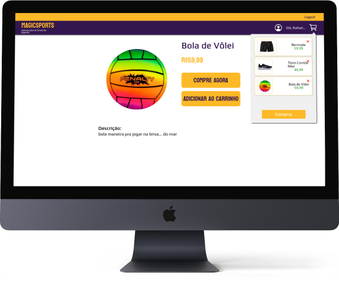
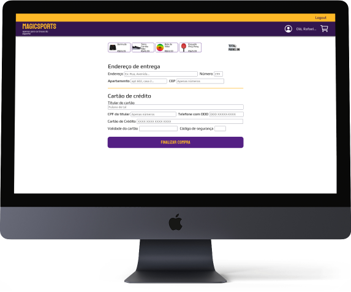

<p align="center">
 
</p>

<h3 align="center">MAGICSports</h3>

<div align="center">

[]()
[](https://github.com//raferdev/MAGICSPORTS-front/issues)
[](https://github.com/raferdev/MAGICSPORTS-front/pulls)
[](/LICENSE)

</div>

---

<p align="center">
 
 
</p>

---

<p align="center"> 
This is a frontend part of FullStack project. The backend you can see <a href="https://github.com/raferdev/MAGICSPORTS-back">here</a>. This project was built using ReactJS, and simulate one e-commerce application.
</p>

---

## 📝 Table of Contents

- [About](#about)
- [Getting Started](#getting_started)
- [Usage](#usage)
- [Built Using](#built_using)
- [Authors](#authors)

---

## 🧐 About <a name = "about"></a>

This project was built on one week and encrease my consepts about javascript enviroment, using ReactJS, and NodeJS to create one web app completly. This frontend simulate one e-commerce. User can see all products without account, and can register youself if want to save your list on shopping cart. <a href="https://github.com/raferdev/MAGICSPORTS-back">(backend)</a>.

---

## 🏁 Getting Started <a name = "getting_started"></a>

You can clone the project and start on your local host like below.

### Prerequisites

You need install **_GIT_** if you don't already have, to clone project,.

<a href="https://git-scm.com/downloads">Click here</a> or Acess:

```
https://git-scm.com/downloads
```

You need install **_Docker_** on your machine if you don't already have.

<a href="https://docs.docker.com/get-docker">Click here</a> or Acess:

```
https://docs.docker.com/get-docker/
```

And use the step-by-step doc to download and install on your specific system.

### Installing

1 - Clone on your local system

```
git clone https://github.com/raferdev/MAGICSPORTS-front
```

2 - Go to project path

```
cd MAGICSPORTS-front
```

3 - Create env file

You can rename the ".env.exemple" file to ".env", just removing ".exemple" and save, or follow this steps to create new one:

- Open a text editor or other editor do you prefeer, create this variables like below and save file with name '.env'.

```
REACT_APP_HTTP=http://localhost:5000/
```

You can change the values of variables if you want or need.

### Start

Use on terminal:

```
npm start
```

_The attached console will show:_

```
Starting the development server...

Compiled successfully!

You can now view mywallet-front in the browser.

Local:            http://localhost:3000
On Your Network:  http://172.22.0.2:3000

Note that the development build is not optimized.

webpack compiled successfully
```

---

## 🎈 Usage <a name="usage"></a>

Now you can access the route below on browser:

```
http://localhost:3000/
```

- **GUIDE** :

    

  - **/route** - the path route did you can acess using your host

```
- Here you can see the
description of what you
can do on this page.


```

---

**Exemple:**

- **/sign-in**

    

  ```
  INPUT:
  - Email = If you have a
  valid registered email
  you can put here.
  - Password = If you have one
  registered email you can put
  the respective password here.

  BUTTON:
  - "Entrar": Send request to
  signin when you put one email
  and password.

  LINK:
  - "Primeira vez?
     Cadastre-se!":
  Here you can use if you won't
  have one
  registered accont yet (your
  fisrt time using the app)

  ```

  ***

  **Usage**

  - On all frontend access you will use GET method, it's just copy and paste the route on browser or use by clicking on the buttons and links. In this case you will make a request on _http://localhost:3000/signin_ to see and interact with the page using by the above instructions.

  ***

**LET'S GO** - API description.

- **/sign-in**

    

```
INPUT:
    - "Email" = If you have a
    valid registered email
    you can put here.
    - "Senha" = If you have one
    registered email you can put
    the respective password here.

BUTTON:
    - "Entrar": Send request to
    signin when you put one email
    and password.

LINK:
    - "Primeira vez?
       Cadastre-se!":
    Here you can use if you won't
    have one
    registered accont yet (your
    fisrt time using the app)
```

- **/sign-up**



```
    INPUT:
    - "Nome" = Put your name.
    - Email = Put your email.
    - "Senha" = Put your password.
    - "Confirme sua senha" =
        confirm your password.

    BUTTON:
    - "Cadastrar" = Send request
    to signup when you put name,
    email and password.

    LINK:
    - "Já tem uma conta?
     Entre agora!" =
    Here you can use if you
    have one registered accont.

```

- **/**



```
BUTTON:
    - Signin = Send to
    login page.
    - Signup = Send to
    signup page.
    - Logout = If logged,
    user can click to
    logged out.
    - Cart List = The cart icon
    on the top right of page
    you can click to open list
    of interest products.

OVERVIEW:
    - Here you see all list of products on selling.

```

- **product/:productID**



```

BUTTON:
    - "Comprar" =
    Here you go to checkout page
    to confirm your buy.
    - "Adicionar ao Carrinho" =
    Here you will add the product
    on cart list.
    - Shopping Cart Icon =
    Click to see the list

OVERVIEW:
    -  Here you can see the
    product description.

```

- **/checkout**



```
- DON'T USE VALID INFORMATIONS
INPUT:
    - "Endereço de entrega" = You can
    put one address.
    - "Apartamento" = You can put
    one house or flat number.
    (min 3 letters)
    - "CEP" = Use one number
    with length 8.
    - "Número" = You can
    describe the transaction.
    (min 3 letters)
    - "Titular do Cartão" = Name of the
    credit card owner.
    - "CPF" = Number with
    length 11.
    - "Telefone com DDD" = Number phone
    with length 12.
    - "Cartão de Crédito" = Number of the
    credit card with length 16.
    - "Validade do Cartão" = Number.
    - "Código de segurança" = Number with
    length 3.
```

---

## ⛏️ Built Using <a name = "built_using"></a>

- [ReactJS](https://pt-br.reactjs.org/) - Super Library Javascript
- [CSS](https://developer.mozilla.org/pt-BR/docs/Web/CSS) - Style Language
- [Docker](https://www.docker.com/) - Container Technology

---

## ✍️ Authors <a name = "authors"></a>

- [@raferdev](https://github.com/raferdev)
- [@NikolasRR](https://github.com/NikolasRR)
